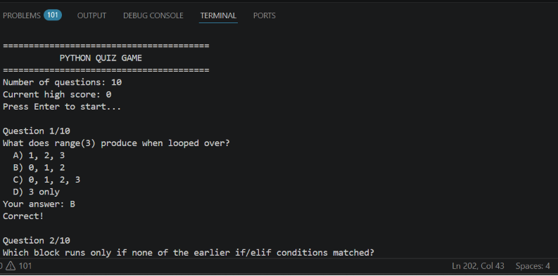
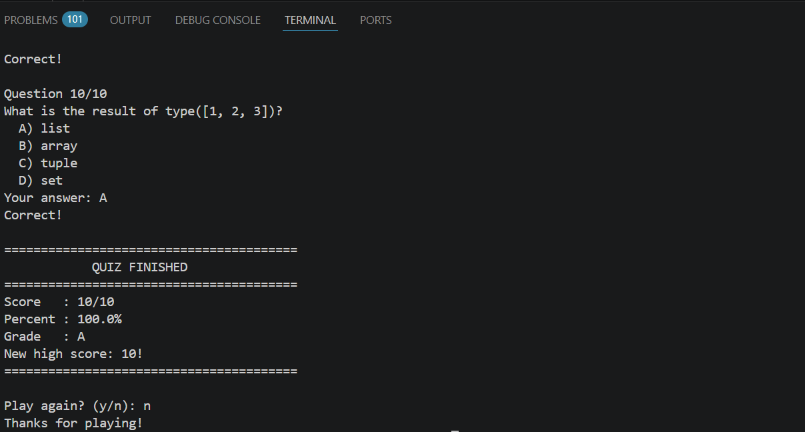

# Python Quiz Game

**Name:** _Sara Kaleem_ 
**Registration No:** _CX-INT-2026-PY-0159_

A command-line quiz game. Questions are pulled from a bank, shuffled into random order each round, and the player answers with A/B/C/D. At the end you get a score, a percentage, and a letter grade, and your best score is saved so future rounds can try to beat it.

## How it's built

All 15 questions live in one list called question_bank, where each question is a dictionary with its text, its four options, and the correct letter — same idea as the guide, written with my own questions and my own variable names. Each game feature (asking a question, grading, tracking the high score) is its own function, following the same plain-function style used in Project 1 and Project 2.

## How to run it
```bash
python3 quiz_game.py
```

Only the standard library is used (random) — no installs needed.

## Features implemented
- **Randomized question order** — the full question bank is shuffled with random.shuffle() each round, and only 10 of the 15 questions are used per game so it plays a bit differently each time.
- **Answer validation** — only A, B, C, or D are accepted; anything else re-prompts the player.
- **Instant feedback** — tells the player right away if they were correct, and shows the correct answer if they weren't.
- **Scoring and grading** — score out of 10, percentage, and a letter grade (A–F) based on performance.
- **High score tracking** — the best score is saved to highscore.txt and loaded back in on the next run; a new best triggers a "new high score" message.
- **Play again loop** — after each round, the player can choose to play again or exit.
- 15 total questions covering comments, loops, functions, file handling, strings, data types, and error handling.

## Project structure
```
quiz_game/
├── quiz_game.py     # main game
├── highscore.txt     # created automatically after your first game
├── README.md
└── screenshots/
    ├── quiz_question.png
    └── quiz_results.png
```

## Screenshots

### Quiz Question


### Quiz Result
